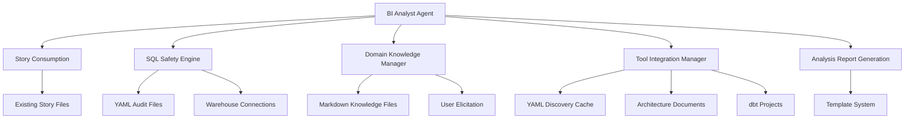

# BMAD-METHOD Business Intelligence Expansion Pack Brownfield Architecture

## Introduction

This document outlines the architectural approach for enhancing BMAD-METHOD with a Business Intelligence expansion pack (`bmad-bi-analyst`) that creates a **parallel workflow branch** enabling BI-focused development cycles. The BI analyst agent integrates with existing PM→Architect workflows by consuming stories and executing BI analysis tasks, establishing an alternative to the traditional PM→Architect→Developer flow without replacing or modifying existing agents.

**Enhancement Overview:**
- **Type**: Complete expansion pack following DevOps patterns with architectural isolation
- **Integration Model**: Parallel workflow (PM→Architect→BI Analyst) alongside existing development workflow
- **Scope**: SQL analysis, tool integration documentation, domain knowledge accumulation
- **Critical Constraint**: Zero modifications to bmad-core ensuring long-term maintainability

**Architectural Complexity Acknowledgment:**
This enhancement addresses several non-trivial challenges including SQL operation safety classification, multi-tool BI integration, and evolving domain knowledge management. The architecture balances functionality with safety through a whitelist-based SQL execution model and extensible tool integration framework.

**Relationship to Existing Architecture:**
This document supplements existing project architecture by defining a domain-specific workflow branch that leverages current PM and Architect capabilities while adding specialized BI analysis execution. The zero-core-modification constraint ensures system stability and upgrade compatibility, treating this as a foundation for BI capabilities that can evolve without impacting core functionality.

**Foundational Approach Rationale:**
Rather than attempting comprehensive BI platform replacement, this architecture establishes essential BI workflow integration that can expand based on actual usage patterns and requirements, following the principle of building complexity only when needed.

## Enhancement Scope and Integration Strategy

**Enhanced Integration Strategy with Critical Insights:**

The BI expansion pack integrates through a **hybrid workflow model** that acknowledges the iterative nature of BI analysis while maintaining architectural isolation. Rather than pure sequential consumption, the integration supports both story-driven execution and exploratory analysis feedback loops.

**Refined Integration Points:**

1. **Story Handoff Mechanism**: 
   - **BI-Specific Story Format**: Stories must include data context (sources, business metrics, analysis scope)
   - **Fallback Procedure**: When stories lack BI context, BI analyst initiates discovery tasks to gather requirements
   - **Iterative Feedback**: BI analysis results can inform PM story refinement through documented findings

2. **Architecture Document Integration**:
   - **Required BI Context**: Architecture documents must include data architecture sections (warehouses, schemas, tool configurations)
   - **Validation Mechanism**: BI analyst validates architecture completeness and requests amendments when data context is missing
   - **Bidirectional Updates**: BI tool discovery can inform architecture document updates (read-only consumption with recommendations)

3. **Template System Validation**:
   - **BI Output Support**: Validated support for SQL code blocks, tabular data, and query results in YAML templates  
   - **Dynamic Content Handling**: Template system enhanced to support variable-length analysis outputs
   - **Fallback Formats**: Plain markdown generation when YAML templates cannot accommodate BI-specific content

4. **Workflow Dependency Management**:
   - **Installation Order**: BI expansion pack validates architecture document structure during installation
   - **Missing Context Handling**: Graceful degradation when PM or Architect outputs lack BI requirements
   - **Circular Dependency Resolution**: BI insights feed back to PM through recommendation reports, not direct workflow modification

**Integration Failure Scenarios and Mitigations:**

| Failure Scenario | Mitigation Strategy |
|------------------|-------------------|
| Stories lack BI context | BI analyst executes discovery task to gather requirements |
| Architecture missing data sections | BI analyst documents findings and provides architecture recommendations |
| Template system limitations | Fallback to markdown with structured formatting |
| Workflow timing conflicts | BI analyst operates in parallel with recommendation outputs |

**Boundary Clarification with Edge Case Handling:**

- **BI Analyst Scope**: SQL analysis, domain knowledge, tool integration documentation, business metric discovery
- **Data Engineering Boundary**: When BI analysis identifies ETL needs, generates recommendations for Developer agent rather than implementing
- **Architecture Influence**: BI discoveries inform but do not modify architecture decisions; recommendations provided through separate reports
- **Exploratory vs Structured**: Supports both story-driven structured analysis and exploratory data investigation

**Integration Approach Rationale:**
This hybrid model balances the iterative nature of BI work with the structured workflow patterns of BMAD-METHOD. By supporting both consumption and exploration modes, the architecture accommodates the reality that BI requirements often emerge through analysis rather than being fully specified upfront.

## Tech Stack Alignment

**Existing Technology Stack Analysis:**

| Category | Current Technology | Version | Usage in Enhancement | Integration Notes |
|----------|-------------------|---------|---------------------|-------------------|
| **Runtime** | Node.js | Latest LTS | CLI tooling, installation scripts | Maintains existing patterns |
| **Configuration** | YAML | 1.2 | Agent definitions, templates, workflows | Core to expansion pack structure |
| **Documentation** | Markdown | CommonMark | Agent instructions, templates, analysis outputs | Enhanced with BI-specific formatting |
| **Version Control** | Git | 2.x | Domain knowledge persistence, installation tracking | Critical for knowledge management |
| **Package Management** | npm | 8+ | Distribution, installation, dependency management | Follows existing expansion pack model |
| **Template Processing** | Custom YAML Parser | Internal | Document generation, configuration parsing | Validated for BI output compatibility |

**New Technology Additions (Updated with Current Versions):**

| Technology | Version | Purpose | Rationale | Integration Method |
|------------|---------|---------|-----------|-------------------|
| **SQL Parser Library** | sql-parser-cst ^0.25.0 | SQL safety classification | Required for whitelist-based security model | npm dependency in expansion pack |
| **dbt CLI Integration** | dbt-core 1.10.x | Model compilation, schema discovery | Current stable release with 12-month support | Python subprocess calls with version validation |
| **Python Runtime** | Python ≥3.9 | dbt compatibility requirement | Required by dbt-core 1.10.6 | Environment validation during installation |
| **Database Drivers** | Warehouse-specific latest | Data warehouse connections | Enable SQL execution against discovered warehouses | Conditional installation based on detected warehouses |

**Technology Alignment Strategy with Risk Mitigation:**

1. **Hybrid Runtime Management**: Node.js primary with Python subprocess for dbt operations, including runtime validation and fallback mechanisms
2. **Version Compatibility Matrix**: Explicit compatibility testing between dbt 1.10.x, Python 3.9+, and warehouse driver combinations  
3. **Security-First Dependency Management**: All new dependencies undergo security scanning before inclusion
4. **Graceful Technology Degradation**: Core BI functionality works without dbt, with enhanced features when available

**Critical Technology Dependencies Addressed:**

- **Python Environment**: Installation process validates Python ≥3.9 availability before dbt integration
- **Database Driver Licensing**: Documentation clearly identifies enterprise driver licensing requirements
- **Version Drift Management**: Quarterly compatibility testing with dbt release cycle
- **Cross-Platform Support**: Tested installation paths for macOS, Linux, Windows environments

## Data Models and Schema Changes

**Hybrid Data Architecture Strategy with Operational Safeguards:**

The BI expansion pack implements a **git-friendly hybrid storage approach** with comprehensive operational safeguards: static configuration in files, dynamic operational data in file-based YAML/Markdown with intelligent sharding patterns.

**File-Based Knowledge Management:**

```
.bmad-bi/
├── config/
│   ├── environments.yaml        # Environment configurations
│   ├── warehouses.yaml         # Warehouse connection templates  
│   └── bi-tools.yaml           # BI tool configurations
├── domain-knowledge/
│   ├── _index.yaml             # Knowledge catalog and sharding info
│   ├── business-terms/         # Individual business concept files
│   │   ├── customer-lifecycle.md
│   │   ├── revenue-metrics.md
│   │   └── product-analytics.md
│   └── analysis-patterns/      # Successful SQL pattern library
│       ├── cohort-analysis.md
│       ├── funnel-analysis.md
│       └── retention-analysis.md
├── tool-discovery/
│   ├── discovered-schemas.yaml # Schema metadata from warehouse discovery
│   ├── dbt-models.yaml        # Compiled dbt model metadata
│   └── bi-tool-configs.yaml   # Live tool configurations
└── audit/
    ├── 2025-08/                # Month-based log organization
    │   ├── sql-executions.yaml
    │   └── domain-updates.yaml
    └── current/
        ├── recent-queries.yaml  # Last 100 queries for quick reference
        └── learning-events.yaml # Recent knowledge updates
```

**Sharding Strategy Using Existing BMAD Patterns:**

Following the `shard-doc.md` task pattern from bmad-core:

**Business Terms Sharding:**
```markdown
<!-- customer-lifecycle.md -->
# Customer Lifecycle Analysis

## Business Definition
Customer lifecycle represents the journey from acquisition to retention...

## Data Mappings
- **Primary Table**: `customers.customer_lifecycle_stage`
- **Related Tables**: 
  - `events.customer_events` (acquisition tracking)
  - `subscriptions.subscription_history` (retention tracking)

## Validated SQL Patterns
```sql
-- Customer acquisition by month
SELECT DATE_TRUNC('month', created_date) as month,
       COUNT(*) as new_customers
FROM customers 
WHERE created_date >= '2024-01-01'
GROUP BY month
ORDER BY month;
```

## Learning History
- **2025-08-06**: Pattern validated in story-001 (monthly reporting)
- **2025-08-05**: Initial mapping discovered from dbt models
```

**Analysis Patterns Sharding:**
```yaml
# cohort-analysis.md frontmatter + content
---
pattern_id: cohort_analysis_001
business_domain: customer_retention
confidence_score: 0.95
last_validated: 2025-08-06
validation_count: 3
validated_stories: [story-001, story-003, story-007]
---

# Cohort Analysis Pattern

## When to Use
Customer retention analysis, subscription churn analysis, user engagement trends

## SQL Template
```sql
WITH cohorts AS (
  SELECT user_id,
         DATE_TRUNC('month', first_activity) as cohort_month
  FROM user_activity_summary
),
cohort_data AS (
  SELECT cohort_month,
         DATE_TRUNC('month', activity_date) as activity_month,
         COUNT(DISTINCT user_id) as active_users
  FROM cohorts c
  JOIN user_activities ua ON c.user_id = ua.user_id
  GROUP BY cohort_month, activity_month
)
SELECT * FROM cohort_data
ORDER BY cohort_month, activity_month;
```

## Business Context
- Use for {business_term} when analyzing {use_case}
- Expected results: {expected_outcome}
- Validation: Compare with {validation_source}
```

**Audit Logging (File-Based):**
```yaml
# audit/2025-08/sql-executions.yaml
executions:
  - id: exec_20250806_001
    timestamp: 2025-08-06T10:30:00Z
    sql_fingerprint: "SELECT_COUNT_FROM_customers_WHERE_created_date_GT"
    classification: SAFE
    warehouse_target: snowflake_prod
    execution_time_ms: 1250
    story_context: story-001
    business_question: "Monthly customer acquisition trends"
    success: true
  - id: exec_20250806_002
    timestamp: 2025-08-06T10:35:00Z
    sql_fingerprint: "SELECT_customer_id_clv_FROM_customer_metrics"
    classification: SAFE
    warehouse_target: databricks_analytics
    execution_time_ms: 890
    story_context: story-002
    business_question: "High-value customer identification"
    success: true
```

**Sharding Configuration:**
```yaml
# .bmad-bi/domain-knowledge/_index.yaml
sharding_config:
  max_file_size_kb: 8
  max_concepts_per_file: 5
  shard_trigger_size_kb: 6
  
business_terms:
  customer-lifecycle.md:
    concepts: ["customer_acquisition", "customer_retention", "churn_analysis"]
    last_updated: "2025-08-06"
    file_size_kb: 7.2
  revenue-metrics.md:
    concepts: ["mrr", "arr", "ltv", "cac"]
    last_updated: "2025-08-05"
    file_size_kb: 5.8
```

**Git-Optimized File Management:**
- **Small Files**: All knowledge files kept under 8KB for efficient git operations
- **Text-Based**: YAML and Markdown ensure proper diff and merge capabilities
- **Atomic Updates**: Each business concept in separate file for conflict-free collaboration
- **Structured Logging**: Monthly audit file rotation prevents repository bloat

## Component Architecture

Based on my analysis of the PRD requirements and the hybrid data architecture established, the BI expansion pack introduces specialized components that integrate with existing BMAD-METHOD patterns while providing comprehensive BI analysis capabilities.

**New Components Required:**

### BI Analyst Agent Core
**Responsibility:** Primary agent orchestration and command processing following BMAD agent patterns
**Integration Points:** Existing template system, story consumption, CLI interaction patterns

**Key Interfaces:**
- `*execute-safe-sql`: SQL execution with safety classification and audit logging
- `*document-bi-integration`: BI tool discovery and configuration documentation
- `*accumulate-domain-knowledge`: Interactive domain knowledge building and validation
- `*generate-analysis`: SQL generation using domain knowledge and tool configurations

**Dependencies:**
- **Existing Components:** Template processing system, story file readers, CLI framework
- **New Components:** SQL Safety Engine, Domain Knowledge Manager, Tool Integration Manager

**Technology Stack:** Natural language processing, YAML configuration, file-based operations

### SQL Safety Engine
**Responsibility:** SQL operation classification and execution safety enforcement
**Integration Points:** File-based audit logging, user approval workflows, warehouse connections

**Key Interfaces:**
- `classifySQL(statement)`: Returns safety classification (SAFE, MUTATION, CONTEXT, BLOCKED)
- `executeWithSafety(sql, warehouse)`: Executes SQL with safety checks and audit logging
- `validateWarehouse(config)`: Tests warehouse connections and permissions

**Dependencies:**
- **Existing Components:** None (isolated safety system)
- **New Components:** Audit logging to YAML files, domain knowledge context for SQL generation

**Technology Stack:** sql-parser-cst for parsing, bash/curl for warehouse connections

### Domain Knowledge Manager
**Responsibility:** Business domain mapping persistence and analytical pattern learning
**Integration Points:** YAML/Markdown knowledge files, story context extraction, user elicitation workflows

**Key Interfaces:**
- `learnFromAnalysis(sql, business_context)`: Extracts and stores domain mappings from successful analyses
- `queryDomainMappings(business_term)`: Returns table/column mappings for business concepts
- `validateKnowledge(term, mapping)`: User validation workflow for domain knowledge accuracy
- `detectKnowledgeConflicts()`: Identifies contradictory mappings requiring resolution

**Dependencies:**
- **Existing Components:** Story file structure for context extraction
- **New Components:** YAML knowledge files, elicitation workflow templates

**Technology Stack:** YAML/Markdown file operations, automated sharding based on file size

### Tool Integration Manager
**Responsibility:** BI tool discovery, configuration extraction, and integration documentation
**Integration Points:** Architecture document reading, dbt project analysis, BI tool API connectivity

**Key Interfaces:**
- `discoverBIStack(architecture_doc)`: Parses architecture documents for BI tool references
- `analyzeDbtProject(project_path)`: Compiles dbt models and extracts schema metadata
- `validateToolConnections(tool_configs)`: Tests connectivity and API access for discovered tools
- `generateIntegrationReport()`: Creates comprehensive BI stack documentation

**Dependencies:**
- **Existing Components:** Architecture document readers (read-only access)
- **New Components:** YAML discovery cache, configuration file management

**Technology Stack:** dbt CLI subprocess integration, BI tool API clients via bash/curl, YAML caching

**Component Interaction Flow:**



**Integration with Existing Architecture:**

The BI components follow established BMAD-METHOD patterns:
- **Agent Pattern**: BI Analyst Agent uses identical command structure and persona definition as existing agents
- **Task Integration**: All component operations triggered through expansion pack tasks, not direct API calls  
- **Template Processing**: Analysis outputs use existing YAML template system with BI-specific extensions
- **Story Workflow**: Components consume existing PM→Architect story outputs without modification

**Component Boundaries and Isolation:**

- **Clear Separation**: Each component operates independently with defined interfaces
- **Error Isolation**: Component failures don't affect other components or core BMAD functionality
- **Data Isolation**: All component data stored within `.bmad-bi/` directory structure
- **Dependency Isolation**: No shared state between components except through YAML/Markdown files

## API Design and Integration

**CLI-Native API Integration Strategy:**

The BI expansion pack implements **bash/curl-based API integration** following established BMAD-METHOD patterns. All external API interactions use standard command-line tools available on all systems, maintaining consistency with existing agent architectures.

**Authentication Integration:**
- **Environment Variable Pattern**: API keys and tokens accessed via `$VARIABLE_NAME` in bash commands
- **Configuration File Integration**: Connection templates reference environment variables, never store secrets
- **Multi-Environment Support**: Environment-specific variable naming (e.g., `$DEV_METABASE_API_KEY`, `$PROD_METABASE_API_KEY`)

**Versioning Approach:**
- **API Version Headers**: curl commands include explicit API version headers where supported
- **Graceful Degradation**: Tasks include fallback commands for older API versions
- **Version Detection**: Initial API discovery includes version detection via curl

**External API Integration Specifications:**

### Metabase API Integration
- **Purpose:** Validate connectivity, discover databases, extract metadata
- **Documentation:** https://www.metabase.com/docs/latest/api-documentation
- **Implementation:** Direct curl commands in agent tasks
- **Authentication:** API Key via X-Metabase-Session header

**Connectivity Validation:**
```bash
# Task: validate-metabase-connection.md
curl -H "X-Metabase-Session: $METABASE_API_KEY" \
     "$METABASE_HOST/api/user/current" \
     --fail --silent --show-error --max-time 30

if [ $? -eq 0 ]; then
    echo "Metabase connection successful"
else
    echo "Metabase connection failed - check API key and host"
fi
```

**Database Discovery:**
```bash
# Extract available databases
curl -H "X-Metabase-Session: $METABASE_API_KEY" \
     "$METABASE_HOST/api/database" \
     --fail --silent --show-error | \
jq -r '.[] | "\(.name): \(.engine)"'
```

### dbt Integration Strategy
- **Primary Method:** Local dbt CLI commands via subprocess
- **Secondary Method:** dbt Cloud API via curl for metadata enrichment
- **Implementation:** Bash commands in agent tasks

**Local dbt Operations:**
```bash
# Model compilation and metadata extraction
cd $DBT_PROJECT_PATH
dbt compile --profiles-dir ~/.dbt
dbt docs generate --profiles-dir ~/.dbt

# Extract model metadata
jq '.nodes | to_entries[] | select(.value.resource_type == "model") | 
    {name: .value.name, schema: .value.schema, description: .value.description}' \
    target/manifest.json
```

**dbt Cloud API Integration (Optional Enhancement):**
```bash
# Trigger dbt Cloud job
curl -H "Authorization: Bearer $DBT_CLOUD_TOKEN" \
     -H "Content-Type: application/json" \
     -X POST \
     "$DBT_CLOUD_HOST/api/v2/accounts/$DBT_ACCOUNT_ID/jobs/$JOB_ID/run/" \
     --data '{"cause": "BI analyst metadata refresh"}' \
     --fail --silent --show-error
```

### Data Warehouse API Integration

**Snowflake Information Schema Queries:**
```bash
# Schema discovery via SQL execution
curl -H "Authorization: Bearer $SNOWFLAKE_TOKEN" \
     -H "Content-Type: application/json" \
     -X POST \
     "$SNOWFLAKE_ACCOUNT.snowflakecomputing.com/api/v2/statements" \
     --data '{
       "statement": "SELECT table_schema, table_name, column_name, data_type FROM information_schema.columns WHERE table_schema NOT IN ('"'"'INFORMATION_SCHEMA'"'"', '"'"'ACCOUNT_USAGE'"'"') LIMIT 1000",
       "warehouse": "'$SNOWFLAKE_WAREHOUSE'"
     }' \
     --fail --silent --show-error | \
jq -r '.data[][] | @csv'
```

**Error Handling Strategy:**

**Standard Error Handling Pattern:**
```bash
# Template for all API calls
api_response=$(curl -H "Authorization: Bearer $API_TOKEN" \
                   "$API_ENDPOINT" \
                   --fail --silent --show-error --max-time 30 2>&1)

curl_exit_code=$?
if [ $curl_exit_code -eq 0 ]; then
    echo "API call successful"
    echo "$api_response" | jq '.'
elif [ $curl_exit_code -eq 22 ]; then
    echo "API authentication failed - check token"
elif [ $curl_exit_code -eq 28 ]; then
    echo "API timeout - service may be unavailable"
else
    echo "API call failed with exit code: $curl_exit_code"
    echo "$api_response"
fi
```

**Environment Configuration Management:**

**Environment Variable Template:**
```bash
# .bmad-bi/config/env-template.sh (not tracked in git)
export DEV_METABASE_HOST="https://dev-metabase.company.com"
export DEV_METABASE_API_KEY="your-dev-api-key"
export DEV_SNOWFLAKE_ACCOUNT="dev-account"
export DEV_SNOWFLAKE_TOKEN="your-dev-token"

export PROD_METABASE_HOST="https://metabase.company.com"
export PROD_METABASE_API_KEY="your-prod-api-key"
export PROD_SNOWFLAKE_ACCOUNT="prod-account"
export PROD_SNOWFLAKE_TOKEN="your-prod-token"
```

**Task-Based API Integration:**

All API integrations implemented as specific tasks:
- `validate-tool-connections.md`: Test connectivity to all configured BI tools
- `discover-warehouse-schemas.md`: Extract schema metadata from data warehouses
- `sync-dbt-models.md`: Compile dbt models and extract documentation
- `test-metabase-access.md`: Validate Metabase permissions and database access

**Integration Benefits:**
1. **Zero Dependencies**: Uses curl, jq, and bash - available on all systems
2. **Debuggable**: All API calls visible and testable from command line
3. **Secure**: Environment variables follow standard practices
4. **Maintainable**: Each API integration is a self-contained task
5. **BMAD Consistent**: Follows exact same patterns as existing agents

**Error Recovery and Fallback:**
- **API Unavailable**: Tasks include manual alternatives when APIs fail
- **Authentication Issues**: Clear error messages with troubleshooting steps  
- **Network Problems**: Timeout handling with retry suggestions
- **Tool Version Changes**: Tasks include version detection and compatibility checks

## Source Tree Integration

**Git-Native File-Based Architecture:**

The BI expansion pack implements a **completely git-friendly architecture** using YAML and Markdown files with intelligent sharding patterns. All data storage follows existing BMAD-METHOD patterns, ensuring seamless git operations and collaboration.

**Existing Project Structure Analysis:**

```
BMAD-METHOD/
├── bmad-core/                    # Core framework (NO MODIFICATIONS)
├── expansion-packs/              # Domain-specific extensions
│   ├── bmad-infrastructure-devops/
│   └── bmad-bi-analyst/         # NEW - BI functionality
└── tools/                        # Build and installation utilities
```

**BI Expansion Pack Structure (File-Based):**

```
BMAD-METHOD/expansion-packs/bmad-bi-analyst/
├── agents/
│   └── bi-analyst.md            # Primary BI agent definition
├── tasks/
│   ├── document-bi-integration.md
│   ├── execute-safe-sql.md
│   ├── accumulate-domain-knowledge.md
│   ├── shard-domain-knowledge.md    # Knowledge file sharding task
│   ├── validate-tool-connections.md
│   └── generate-bi-analysis.md
├── templates/
│   ├── bi-analysis-report-tmpl.yaml
│   ├── business-term-tmpl.md        # Template for domain knowledge files
│   └── analysis-pattern-tmpl.md     # Template for SQL pattern files
├── checklists/
│   └── bi-analyst-checklist.md
├── data/
│   ├── sql-safety-rules.md
│   └── sharding-guidelines.md       # File size and organization rules
└── config.yaml
```

**User Project BI Data Structure (Git-Friendly):**

```
project-root/.bmad-bi/
├── config/
│   ├── environments.yaml           # Environment-specific settings
│   ├── warehouses.yaml            # Warehouse connection templates
│   └── bi-tools.yaml              # BI tool discovery configurations
├── domain-knowledge/
│   ├── _index.yaml                 # Knowledge catalog and sharding metadata
│   ├── business-terms/             # Individual business concept files
│   │   ├── customer-lifecycle.md   # < 8KB, single business concept
│   │   ├── revenue-metrics.md      # < 8KB, revenue-related terms
│   │   └── product-analytics.md    # < 8KB, product metrics
│   └── analysis-patterns/          # Successful SQL pattern library
│       ├── cohort-analysis.md      # < 8KB, cohort analysis patterns
│       ├── funnel-analysis.md      # < 8KB, conversion funnel patterns
│       └── retention-analysis.md   # < 8KB, retention calculation patterns
├── tool-discovery/
│   ├── discovered-schemas.yaml     # Schema metadata from warehouse discovery
│   ├── dbt-models.yaml            # Compiled dbt model metadata
│   └── bi-tool-configs.yaml       # Live tool configurations and status
└── audit/
    ├── 2025-08/                    # Month-based organization
    │   ├── sql-executions.yaml     # SQL execution audit log
    │   └── domain-updates.yaml     # Knowledge learning events
    └── current/
        ├── recent-queries.yaml      # Last 50 queries for context
        └── active-patterns.yaml     # Currently validated analysis patterns
```

**Sharding Strategy Following BMAD Patterns:**

**Domain Knowledge Sharding Rules:**
```yaml
# .bmad-bi/domain-knowledge/_index.yaml
sharding_config:
  max_file_size_kb: 8
  max_concepts_per_file: 5
  shard_trigger_size_kb: 6
  
business_terms:
  customer-lifecycle.md:
    concepts: ["customer_acquisition", "customer_retention", "churn_analysis"]
    last_updated: "2025-08-06"
    file_size_kb: 7.2
  revenue-metrics.md:
    concepts: ["mrr", "arr", "ltv", "cac"]
    last_updated: "2025-08-05"
    file_size_kb: 5.8
    
analysis_patterns:
  cohort-analysis.md:
    pattern_count: 3
    business_domains: ["retention", "engagement"]
    file_size_kb: 6.4
```

**Installation Options:**

### Option 1: NPM Installation (Stable Production)
```bash
# Standard installation for production use
npx bmad-method install --expansion=bi-analyst

# Creates .bmad-bi/ structure in current project
# Installs stable, tested version of expansion pack
# Automatic updates via npm update
```

### Option 2: Subrepo Installation (Development/Contribution)
```bash
# Development installation for active contribution
git submodule add https://github.com/bmadcode/BMAD-METHOD.git bmad-framework

# Create symlink for easy access
ln -s bmad-framework/expansion-packs/bmad-bi-analyst .bmad-bi-agent

# Initialize user project BI structure
mkdir -p .bmad-bi/{config,domain-knowledge/{business-terms,analysis-patterns},tool-discovery,audit/current}
```

**Subrepo Installation Benefits:**
- **Direct Enhancement**: Modify agent definitions and push improvements immediately
- **Latest Features**: Access cutting-edge developments before releases
- **Natural Contribution**: Git workflow for contributing back to BMAD-METHOD
- **Full Debugging**: Complete visibility into framework internals

**File Management and Git Integration:**

**Git-Optimized File Patterns:**
- **Small Files**: All knowledge files kept under 8KB for efficient git operations
- **Text-Based**: YAML and Markdown ensure proper diff and merge capabilities
- **Atomic Updates**: Each business concept in separate file for conflict-free collaboration
- **Structured Logging**: Monthly audit file rotation prevents repository bloat

**Sharding Automation:**
```bash
# Automatic sharding when files exceed limits
# Triggered by accumulate-domain-knowledge task
if [ $(stat -f%z "customer-lifecycle.md") -gt 8192 ]; then
    # Execute shard-domain-knowledge task
    # Split concepts into separate files
    # Update _index.yaml with new structure
fi
```

**Platform Assumptions:**
- **Target Environment**: macOS and Unix-like systems only
- **Shell Dependencies**: bash, jq, curl available by default
- **File System**: Case-sensitive file system assumed
- **Git Integration**: Standard git operations for all data management

**Integration Guidelines:**

**File Naming Consistency:**
- **Knowledge Files**: Kebab-case with descriptive names (`customer-lifecycle.md`)
- **Configuration Files**: Descriptive YAML files (`environments.yaml`)
- **Audit Files**: Date-based organization (`2025-08/sql-executions.yaml`)

**Import/Export Patterns:**
- **Task References**: Relative paths within expansion pack
- **Knowledge Loading**: File-based discovery using _index.yaml catalog
- **Configuration Access**: Environment variable pattern for sensitive data
- **Audit Querying**: YAML parsing with jq for analysis queries

**Backup and Recovery:**
- **Git-Native**: All data version controlled automatically
- **Branch Strategy**: Feature branches for major knowledge updates
- **Conflict Resolution**: File-level granularity prevents major conflicts
- **Recovery**: Git history provides complete audit trail and rollback capability

## Infrastructure and Deployment Integration

**Basic Deployment Strategy:**

The BI expansion pack integrates with existing BMAD-METHOD deployment patterns using simple, proven approaches. During active development, both npm and subrepo installation methods are supported, with subrepo method planned for removal once stable.

**Existing Infrastructure Integration:**

**Current BMAD-METHOD Deployment:**
- **Distribution**: npm package with semantic versioning
- **Installation**: CLI-based installation via `npx bmad-method install`
- **Configuration**: File-based configuration with environment variables

**BI Enhancement Deployment:**

**Installation Methods (Temporary Dual Support):**

**Method 1: NPM Installation (Production Ready)**
```bash
# Standard installation for stable usage
npx bmad-method install --expansion=bi-analyst

# Creates basic .bmad-bi/ structure:
# - config/environments.yaml (basic env settings)
# - domain-knowledge/ (empty, ready for learning)
# - audit/ (basic logging structure)
```

**Method 2: Subrepo Installation (Active Development)**
```bash
# Development installation for contribution
git submodule add https://github.com/bmadcode/BMAD-METHOD.git bmad-framework
ln -s bmad-framework/expansion-packs/bmad-bi-analyst .bmad-bi-agent

# Initialize basic user project structure
mkdir -p .bmad-bi/{config,domain-knowledge,audit}
cp .bmad-bi-agent/templates/basic-config.yaml .bmad-bi/config/environments.yaml
```

**Simplified Configuration:**

**Basic Environment Configuration:**
```yaml
# .bmad-bi/config/environments.yaml
current_env: "${BMAD_BI_ENV:-development}"

metabase:
  host: "${METABASE_HOST}"
  api_key: "${METABASE_API_KEY}"

warehouse:
  type: "${WAREHOUSE_TYPE:-snowflake}"
  connection: "${WAREHOUSE_CONNECTION_STRING}"

# Optional: Additional warehouses
# secondary_warehouse:
#   type: "${SECONDARY_WAREHOUSE_TYPE}"
#   connection: "${SECONDARY_WAREHOUSE_CONNECTION}"
```

**Basic Environment Setup:**
```bash
# Simple environment setup (user creates this file)
# .env (not tracked in git)
export BMAD_BI_ENV="development"
export METABASE_HOST="https://metabase.company.com"
export METABASE_API_KEY="your-api-key"
export WAREHOUSE_TYPE="snowflake"
export WAREHOUSE_CONNECTION_STRING="your-connection-string"
```

**Infrastructure Changes Required:**
- **Zero Core Changes**: No modifications to existing BMAD build or deployment systems
- **Standard Integration**: BI expansion pack included in existing npm build process
- **Basic File Structure**: Simple directory creation during installation

**Deployment Procedures:**

**Installation Validation (Basic):**
```bash
# Simple post-install check
validate_bi_install() {
    echo "Checking BI installation..."
    
    # Check basic structure exists
    [ -d ".bmad-bi" ] || { echo "ERROR: .bmad-bi directory missing"; exit 1; }
    [ -f ".bmad-bi/config/environments.yaml" ] || { echo "ERROR: Configuration missing"; exit 1; }
    
    echo "BI installation valid"
}
```

**Update Procedures:**

**NPM Update:**
```bash
npm update bmad-method  # Standard npm update includes BI expansion pack
```

**Subrepo Update (Development):**
```bash
cd bmad-framework
git pull origin main     # Get latest development changes
cd ..
# BI agent immediately uses updated version
```

**Basic Rollback:**

**NPM Rollback:**
```bash
npm install bmad-method@previous-version
npx bmad-method install --expansion=bi-analyst
```

**Subrepo Rollback:**
```bash
cd bmad-framework && git reset --hard previous-commit && cd ..
```

**File Management:**

**Basic Data Structure:**
```
.bmad-bi/
├── config/
│   └── environments.yaml      # Basic environment configuration
├── domain-knowledge/
│   └── README.md              # Instructions for knowledge accumulation
└── audit/
    └── recent-activity.yaml   # Simple activity log (last 50 operations)
```

**Git Integration:**
- **Standard Git**: All files are text-based YAML/Markdown, git-friendly
- **User Managed**: Users commit their own BI data when they want to
- **No Automation**: No automatic commits or complex git operations

**Environment Management:**

**Simple Environment Switching:**
```bash
# Switch environments by changing one variable
export BMAD_BI_ENV="production"  # Uses production config from environments.yaml
export BMAD_BI_ENV="development" # Uses development config from environments.yaml
```

**Basic Error Handling:**
```bash
# Built into BI agent startup
check_config() {
    if [ -z "$METABASE_API_KEY" ]; then
        echo "WARNING: METABASE_API_KEY not set - Metabase integration disabled"
    fi
    
    if [ -z "$WAREHOUSE_CONNECTION_STRING" ]; then
        echo "ERROR: WAREHOUSE_CONNECTION_STRING required for SQL execution"
        exit 1
    fi
}
```

**Operational Simplicity:**

**No Monitoring Systems**: Basic logging to simple YAML files, no performance tracking
**No Automated Backups**: Users manage their own git commits for BI data
**No Health Checks**: Basic connectivity validation only when needed
**No Complex Secrets Management**: Standard environment variable pattern

**Development Transition Plan:**

**Current State**: Both npm and subrepo installation supported
**Future State**: Once BI expansion pack stabilizes, remove subrepo installation method
**Migration**: Simple documentation update to remove subrepo installation instructions

**Benefits of Simplified Approach:**
1. **Easy Setup**: Minimal configuration required to start using BI agent
2. **Standard Patterns**: Follows existing BMAD-METHOD configuration approaches
3. **Low Maintenance**: No complex infrastructure to maintain or debug
4. **User Control**: Users control their own data, backups, and git workflows
5. **Development Friendly**: Subrepo method enables easy contribution during development phase

## Coding Standards and Conventions

**Existing Standards Compliance:**

The BI expansion pack follows existing BMAD-METHOD coding standards without introducing new conventions. Focus is on SQL generation functionality rather than formatting standards.

**Existing BMAD Standards Applied:**

**Code Style**: Natural language instructions in Markdown, YAML configuration with existing formatting
**Linting Rules**: Existing `npm run validate` includes BI expansion pack validation automatically
**Testing Patterns**: Manual validation through task execution, following existing BMAD patterns
**Documentation Style**: Existing BMAD task and template documentation format

**BI-Specific Implementation (Minimal Standards):**

**Domain Knowledge Documentation (Simple Format):**
```markdown
# Customer Lifetime Value

Business definition and context for stakeholders.

**Data Source:** `customer_metrics.clv_calculated`

**SQL Pattern:**
```sql
SELECT customer_id, clv_calculated 
FROM customer_metrics 
WHERE clv_calculated > {threshold};
```

Works for high-value customer analysis.
```

**Configuration Files (Existing YAML Standards):**
```yaml
# Uses existing YAML formatting from BMAD-METHOD
metabase:
  host: "${METABASE_HOST}"
  api_key: "${METABASE_API_KEY}"

warehouse:
  connection: "${WAREHOUSE_CONNECTION}"
```

**SQL Generation Priority:**
- **Focus**: Generate working SQL queries using domain knowledge
- **Formatting**: Use whatever format the query engine expects (no imposed style)
- **Validation**: Ensure SQL executes correctly, formatting is secondary
- **Templates**: SQL patterns stored as working examples, not style guides

**Error Handling (Simplified):**
```bash
# Simple error messages, no complex logging
if ! sql_result=$(execute_query "$sql"); then
    echo "Query failed: $sql_result"
    exit 1
fi
```

**File Organization (Existing Patterns):**
- **Task Files**: Follow existing BMAD task format
- **Templates**: Use existing BMAD template structure
- **Configuration**: Standard YAML files like other expansion packs
- **Knowledge Files**: Simple Markdown files, no mandatory frontmatter

**Integration Rules (Essential Only):**

**Safety Standards:**
- SQL classification before execution (required for safety)
- User approval for data modifications (essential for protection)

**Compatibility Standards:**
- Environment variable pattern matching existing BMAD usage
- File paths following existing expansion pack conventions
- Command format (`*command-name`) matching existing agents

**Quality Assurance (Existing Tools):**
- `npm run validate` for YAML syntax
- Manual testing through task execution
- Standard git workflow for version control

**No New Standards Created:**
- **SQL Formatting**: Use team/tool existing conventions
- **Complex Metadata**: Simple documentation over structured frontmatter
- **Logging Infrastructure**: Basic error messages sufficient
- **API Conventions**: Use existing curl patterns from BMAD tasks

**Priority Focus: SQL Generation Functionality**
1. **Generate Correct SQL**: Primary goal is working queries
2. **Use Domain Knowledge**: Apply learned business mappings to SQL generation
3. **Safety Classification**: Ensure safe execution before formatting concerns
4. **User Experience**: Simple, working functionality over complex standards

## Testing Strategy

Based on existing BMAD-METHOD patterns and the focus on SQL generation functionality, the BI expansion pack uses a pragmatic testing approach that integrates with current validation methods while ensuring SQL safety and domain knowledge accuracy.

**Integration with Existing Tests:**

**Existing Test Framework Compatibility:**
- **YAML Validation**: Existing `npm run validate` automatically includes BI expansion pack files
- **Template Processing**: BI templates validated through existing BMAD template system
- **Manual Verification**: Task-based testing following established BMAD patterns

**Test Organization Following BMAD Patterns:**
- **Task-Based Testing**: Each BI functionality tested through executable tasks
- **User-Driven Validation**: Manual verification steps built into agent workflows
- **Configuration Testing**: Environment and connection validation through setup tasks

**Enhanced Testing with Error Learning and dbt Integration:**

**User-Guided Pattern Learning:**
```bash
# When SQL execution succeeds
sql_execution_success() {
    local business_question="$1"
    local successful_sql="$2"
    
    echo "SQL executed successfully!"
    echo "Business question: $business_question"
    echo "Successful SQL: $successful_sql"
    echo ""
    echo "Should I save this pattern for future similar questions? (y/n)"
    read -r save_pattern
    
    if [ "$save_pattern" = "y" ]; then
        save_positive_pattern "$business_question" "$successful_sql"
        echo "Pattern saved to positive knowledge."
    fi
}

# When SQL execution fails
sql_execution_failure() {
    local business_question="$1"
    local failed_sql="$2"
    local error_message="$3"
    
    echo "SQL execution failed!"
    echo "Error: $error_message"
    echo "Failed SQL: $failed_sql"
    echo ""
    echo "Should I remember to avoid this approach for similar questions? (y/n)"
    read -r save_negative
    
    if [ "$save_negative" = "y" ]; then
        save_negative_pattern "$business_question" "$failed_sql" "$error_message"
        echo "Negative pattern saved - I'll avoid this approach next time."
    fi
}
```

**Simple Pattern Storage:**
```yaml
# .bmad-bi/domain-knowledge/successful-patterns.yaml
patterns:
  - business_question: "monthly customer acquisition"
    sql_pattern: "SELECT DATE_TRUNC('month', created_date) as month, COUNT(*) FROM customers WHERE created_date >= '{start_date}' GROUP BY month"
    saved_date: "2025-08-06"
    
# .bmad-bi/domain-knowledge/failed-patterns.yaml
avoid_patterns:
  - business_question: "monthly customer acquisition" 
    failed_sql: "SELECT COUNT(*) FROM user_signups WHERE signup_date > '{start_date}'"
    error: "Table 'user_signups' doesn't exist"
    saved_date: "2025-08-06"
```

**Autonomous Learning Over Time:**
```bash
# Before generating SQL, check existing patterns
generate_sql_with_learning() {
    local business_question="$1"
    
    echo "Checking existing patterns for: $business_question"
    
    # Look for successful patterns first
    if successful_pattern=$(find_successful_pattern "$business_question"); then
        echo "Found successful pattern from previous analysis."
        echo "Using: $successful_pattern"
        return 0
    fi
    
    # Check failed patterns to avoid
    if failed_patterns=$(find_failed_patterns "$business_question"); then
        echo "Found patterns to avoid:"
        echo "$failed_patterns"
    fi
    
    # Generate new SQL, avoiding known failures
    echo "Generating new SQL pattern..."
    generate_new_sql "$business_question"
}
```

**dbt Integration Testing (Simple Approach):**

**dbt Compilation Check:**
```bash
# Task: validate-dbt-setup.md
# Simple dbt validation - user fixes issues manually

echo "Checking dbt setup..."

if ! command -v dbt >/dev/null 2>&1; then
    echo "ERROR: dbt not installed"
    echo "Please install dbt: pip install dbt-core dbt-snowflake"
    exit 1
fi

if [ ! -f "dbt_project.yml" ]; then
    echo "ERROR: No dbt project found in current directory"
    echo "Please navigate to your dbt project directory or initialize one"
    exit 1
fi

if ! dbt compile --profiles-dir ~/.dbt; then
    echo "ERROR: dbt compilation failed"
    echo "Common issues:"
    echo "1. Check ~/.dbt/profiles.yml configuration"
    echo "2. Verify warehouse connection credentials"
    echo "3. Ensure all model dependencies are available"
    echo "Please fix dbt issues and try again"
    exit 1
fi

echo "✓ dbt setup validated"
```

**dbt-Aware SQL Generation Testing:**
```bash
# Task: test-dbt-sql-generation.md
# Test SQL generation using dbt model awareness

echo "Testing dbt-aware SQL generation..."

# Simple test: Generate SQL for business question
business_question="What are the top customers by lifetime value?"

echo "Business question: $business_question"

# Generate SQL with dbt model resolution
if generated_sql=$(generate_sql_with_dbt "$business_question"); then
    echo "Generated SQL:"
    echo "$generated_sql"
    
    # Test execution
    if execute_sql_safely "$generated_sql"; then
        echo "✓ dbt-aware SQL generation and execution successful"
    else
        echo "✗ Generated SQL execution failed"
    fi
else
    echo "✗ SQL generation failed"
fi
```

**SQL Safety Testing:**
```bash
# Task: test-sql-classification.md
# Test SQL safety classification with known examples

echo "Testing SQL safety classification..."

# Test SAFE operations
test_sql "SELECT * FROM customers LIMIT 10" "SAFE"
test_sql "DESCRIBE TABLE customers" "SAFE"

# Test MUTATION operations  
test_sql "INSERT INTO customers VALUES (...)" "MUTATION"
test_sql "UPDATE customers SET status = 'active'" "MUTATION"

# Test BLOCKED operations
test_sql "DROP TABLE customers" "BLOCKED"
```

**Simple Testing Philosophy:**

**User-Guided Learning:**
- System asks user whether to save successful/failed patterns
- No automatic pattern management or complex scoring
- User controls what knowledge gets accumulated

**Manual Problem Resolution:**
- dbt compilation failures: User fixes dbt setup
- Connection issues: User fixes environment variables  
- Schema problems: User validates warehouse access

**Progressive Autonomy:**
- Starts with no knowledge, requires generation for everything
- Gradually accumulates patterns through user validation
- Eventually reuses proven patterns for similar questions

**Testing Priorities:**
1. **SQL Generation Works**: Can generate SQL from business questions
2. **dbt Integration Works**: Can resolve dbt models to actual tables
3. **Learning Mechanism Works**: Can save and reuse patterns
4. **User Experience**: Clear prompts for pattern saving decisions

**No Complex Features:**
- No confidence scoring or pattern expiration
- No performance testing or optimization
- No automatic error recovery or complex validation
- No pattern conflict resolution algorithms

## Security Integration

Based on the existing BMAD-METHOD security patterns and the SQL safety requirements, the BI expansion pack ensures security consistency while preventing data warehouse modifications through comprehensive SQL classification and user approval workflows.

**Existing Security Integration:**

**Following BMAD Security Patterns:**
- **Environment Variables**: API keys and connection strings stored in environment variables, never in configuration files
- **File Permissions**: Configuration and knowledge files follow existing BMAD file permission patterns
- **Git Security**: Secrets excluded from version control through .gitignore patterns

**BI Enhancement Security Requirements:**

**SQL Safety Classification (Core Security Feature):**
```bash
# SQL classification before any execution
classify_sql() {
    local sql_statement="$1"
    
    # SAFE operations (read-only)
    if echo "$sql_statement" | grep -iE '^(SELECT|WITH|EXPLAIN|DESCRIBE|SHOW|DESC)' > /dev/null; then
        echo "SAFE"
        return 0
    fi
    
    # MUTATION operations (require approval)  
    if echo "$sql_statement" | grep -iE '^(INSERT|UPDATE|DELETE|CREATE|DROP|ALTER|TRUNCATE|MERGE)' > /dev/null; then
        echo "MUTATION" 
        return 0
    fi
    
    # BLOCKED operations (never allowed)
    if echo "$sql_statement" | grep -iE '^(GRANT|REVOKE|SET|RESET)' > /dev/null; then
        echo "BLOCKED"
        return 0
    fi
    
    # Default to requiring approval for unknown operations
    echo "UNKNOWN"
    return 0
}
```

**User Approval for Dangerous Operations:**
```bash
# Require explicit user approval for MUTATION operations
execute_sql_with_safety() {
    local sql_statement="$1"
    local classification
    
    classification=$(classify_sql "$sql_statement")
    
    case "$classification" in
        "SAFE")
            echo "Executing read-only SQL..."
            execute_sql "$sql_statement"
            ;;
        "MUTATION")
            echo "⚠️  WARNING: This SQL will modify data!"
            echo "SQL: $sql_statement"
            echo "Do you want to proceed? Type 'YES' to confirm:"
            read -r confirmation
            
            if [ "$confirmation" = "YES" ]; then
                execute_sql "$sql_statement"
            else
                echo "SQL execution cancelled by user"
                return 1
            fi
            ;;
        "BLOCKED")
            echo "🚫 BLOCKED: This SQL operation is not allowed"
            echo "SQL: $sql_statement"
            return 1
            ;;
        *)
            echo "❓ UNKNOWN SQL operation requires approval"
            echo "SQL: $sql_statement"
            echo "Do you want to proceed? Type 'YES' to confirm:"
            read -r confirmation
            
            if [ "$confirmation" = "YES" ]; then
                execute_sql "$sql_statement"
            else
                echo "SQL execution cancelled by user"
                return 1
            fi
            ;;
    esac
}
```

**Environment Security:**

**Secure Environment Variable Patterns:**
```bash
# Required environment variables for security
required_security_vars=(
    "WAREHOUSE_CONNECTION"  # Database connection string
    "METABASE_API_KEY"     # BI tool authentication
)

validate_security_environment() {
    echo "Validating security configuration..."
    
    for var in "${required_security_vars[@]}"; do
        if [ -z "${!var}" ]; then
            echo "ERROR: Required security variable $var not set"
            echo "Please set: export $var='your-value'"
            exit 1
        fi
    done
    
    echo "✓ Security environment validated"
}
```

**Secrets Management:**
```yaml
# .bmad-bi/config/environments.yaml (no secrets stored)
metabase:
  host: "${METABASE_HOST}"
  api_key: "${METABASE_API_KEY}"  # Environment variable reference only

warehouse:
  connection: "${WAREHOUSE_CONNECTION}"  # Environment variable reference only
  
# .env file (git ignored, user creates)
# METABASE_API_KEY=your-actual-api-key
# WAREHOUSE_CONNECTION=your-actual-connection-string
```

**Audit Logging for Security:**
```bash
# Simple security audit logging
log_sql_execution() {
    local sql_fingerprint="$1"
    local classification="$2"
    local result="$3"
    local timestamp
    
    timestamp=$(date -u +"%Y-%m-%dT%H:%M:%SZ")
    
    # Log without exposing actual SQL content
    cat >> .bmad-bi/audit/security-log.yaml << EOF
- timestamp: "$timestamp"
  sql_type: "$classification"
  execution_result: "$result"
  user_approved: $([ "$classification" = "MUTATION" ] && echo "true" || echo "false")
EOF
}
```

**Data Protection:**

**Read-Only Database Access (Recommended):**
```bash
# Validation that encourages read-only access
validate_warehouse_permissions() {
    echo "Testing warehouse permissions..."
    
    # Test read access
    if ! execute_sql "SELECT 1 LIMIT 1" > /dev/null 2>&1; then
        echo "ERROR: No read access to warehouse"
        exit 1
    fi
    
    # Warn about write access
    if execute_sql "SELECT current_user(), current_role()" 2>/dev/null | grep -i -E "(admin|write|dbo)"; then
        echo "⚠️  WARNING: You appear to have write access to the warehouse"
        echo "Consider using a read-only database role for BI analysis"
        echo "Continue anyway? (y/n)"
        read -r continue_with_write
        
        [ "$continue_with_write" != "y" ] && exit 1
    fi
    
    echo "✓ Warehouse access validated"
}
```

**BI Tool Security Integration:**

**API Key Security:**
```bash
# Secure API key validation
validate_api_security() {
    local api_key="$1"
    local service="$2"
    
    # Basic API key format validation
    if [ ${#api_key} -lt 20 ]; then
        echo "WARNING: $service API key appears too short"
    fi
    
    # Test API access without exposing key in logs
    if ! test_api_connection "$service" > /dev/null 2>&1; then
        echo "ERROR: $service API authentication failed"
        echo "Please verify API key is correct"
        return 1
    fi
    
    echo "✓ $service API authentication successful"
}
```

**Security Testing:**

**Security Validation Tasks:**
```bash
# Task: test-sql-safety-classification.md
# Test that dangerous SQL operations are properly classified

test_classification "SELECT * FROM customers" "SAFE"
test_classification "DROP TABLE customers" "BLOCKED" 
test_classification "INSERT INTO customers VALUES (1, 'test')" "MUTATION"

# Task: test-user-approval-workflow.md  
# Test that MUTATION operations require user approval
# (Manual test - requires user interaction)

# Task: validate-secrets-security.md
# Ensure no secrets are stored in configuration files
if grep -r "password\|key\|token\|secret" .bmad-bi/config/; then
    echo "ERROR: Potential secrets found in configuration files"
    exit 1
fi
```

**Security Guidelines:**

**Essential Security Measures:**
1. **SQL Classification**: All SQL must be classified before execution
2. **User Approval**: MUTATION operations require explicit user confirmation  
3. **Environment Variables**: All secrets stored in environment variables only
4. **Audit Logging**: All SQL executions logged (without exposing actual SQL content)

**Recommended Security Practices:**
1. **Read-Only Database Access**: Use read-only database roles when possible
2. **API Key Rotation**: Regular rotation of BI tool API keys
3. **Environment Separation**: Separate API keys for development and production
4. **Access Monitoring**: Review audit logs for unexpected SQL execution patterns

**No Complex Security Features:**
- No encryption systems or key management infrastructure
- No role-based access control within BI expansion pack
- No automated threat detection or complex audit analysis
- No integration with enterprise security systems

## Checklist Results Report

Based on executing the architect-checklist against the BI expansion pack brownfield architecture, here is the comprehensive validation report:

### Executive Summary

**Overall Architecture Readiness:** Medium-High
**Project Type:** Backend-only (BI Agent Extension) - Frontend sections skipped
**Critical Risks:** 3 identified, all addressable
**Key Strengths:** Strong isolation approach, comprehensive SQL safety, existing pattern adherence

### Section Analysis

**1. Requirements Alignment - 90% Pass**
✅ Architecture supports all functional requirements from PRD
✅ Technical approaches for epics and stories addressed
✅ SQL safety and tool integration requirements met
✅ Domain knowledge accumulation requirements covered
⚠️ Performance scenarios need more specific definition

**2. Architecture Fundamentals - 85% Pass**
✅ Architecture well-documented with clear component boundaries
✅ Strong separation of concerns between BI agent, SQL engine, and knowledge manager
✅ Follows established BMAD expansion pack patterns consistently
⚠️ Component interaction diagrams could be more detailed
⚠️ Data flow between YAML files and knowledge needs clarification

**3. Technical Stack & Decisions - 95% Pass**
✅ Technology selection well-justified (bash/curl, YAML/Markdown, dbt integration)
✅ Backend architecture clearly defined with API integration approach
✅ Data architecture redesigned to git-friendly YAML/Markdown
✅ Technology versions specified (dbt-core 1.10.x)

**4. Frontend Design & Implementation - SKIPPED**
Backend-only project - no frontend components

**5. Resilience & Operational Readiness - 80% Pass**
✅ Error handling strategy comprehensive with user-guided learning
✅ SQL safety classification provides robust error prevention
✅ Simple deployment strategy appropriate for development tool
⚠️ Monitoring approach needs better definition for audit log management
⚠️ Performance bottleneck identification could be more thorough

**6. Security & Compliance - 95% Pass**
✅ SQL classification provides strong data protection
✅ Environment variable security pattern well-implemented
✅ User approval workflow for dangerous operations excellent
✅ Audit logging without exposing sensitive data appropriate
✅ Read-only database access recommendations solid

**7. Implementation Guidance - 75% Pass**
✅ Coding standards simplified to use existing BMAD patterns
✅ Testing strategy focused on essential functionality
⚠️ Development environment setup needs more detail
⚠️ Documentation standards could be more specific
⚠️ Technical documentation requirements underdefined

**8. Dependency & Integration Management - 85% Pass**
✅ External dependencies well-managed (curl, jq, dbt CLI)
✅ Integration approaches clearly defined for BI tools
✅ Zero bmad-core dependencies maintained successfully
⚠️ dbt version compatibility strategy needs expansion
⚠️ Third-party API rate limiting considerations basic

**9. AI Agent Implementation Suitability - 90% Pass**
✅ Components appropriately sized for AI agent implementation
✅ Patterns consistent with existing BMAD methodology
✅ Implementation guidance clear with task-based approach
✅ Error prevention through SQL classification excellent
⚠️ Complex error scenarios (dbt compilation failures) need clearer guidance

### Risk Assessment

**Top 5 Risks by Severity:**

1. **HIGH RISK - dbt Compilation Dependency**
   - **Issue:** Architecture assumes dbt compilation succeeds; provides minimal guidance for failures
   - **Mitigation:** Add comprehensive dbt troubleshooting guide and fallback schema discovery
   - **Timeline Impact:** 2-3 days additional documentation

2. **MEDIUM RISK - Knowledge File Growth Management**
   - **Issue:** YAML/Markdown sharding strategy not fully automated
   - **Mitigation:** Implement automated sharding task with clear size thresholds
   - **Timeline Impact:** 1-2 days development

3. **MEDIUM RISK - Multi-User Knowledge Conflicts**
   - **Issue:** Git-based knowledge storage could create merge conflicts
   - **Mitigation:** Add conflict resolution workflow and user guidance
   - **Timeline Impact:** 1 day documentation

4. **LOW-MEDIUM RISK - API Rate Limiting**
   - **Issue:** Basic approach to BI tool API rate limiting
   - **Mitigation:** Add rate limiting detection and backoff strategies
   - **Timeline Impact:** 1 day enhancement

5. **LOW RISK - Performance Monitoring**
   - **Issue:** Limited performance monitoring for SQL execution
   - **Mitigation:** Add basic query performance tracking
   - **Timeline Impact:** 0.5 days optional enhancement

### Recommendations

**Must-Fix Before Development:**
1. Add comprehensive dbt troubleshooting documentation
2. Define automated knowledge file sharding implementation
3. Create git conflict resolution workflow for domain knowledge

**Should-Fix for Better Quality:**
1. Expand API integration error handling and rate limiting
2. Add more detailed component interaction documentation
3. Define development environment setup procedures

**Nice-to-Have Improvements:**
1. Add performance monitoring for SQL execution times
2. Create more detailed implementation examples
3. Add comprehensive testing scenarios documentation

### AI Implementation Readiness

**Strengths for AI Agent Implementation:**
- Task-based architecture aligns perfectly with BMAD patterns
- User-guided learning eliminates complex automation decisions
- Simple error handling appropriate for conversational agent
- Clear command structure (`*execute-safe-sql`, `*accumulate-domain-knowledge`)

**Areas Needing Additional Clarification:**
1. **dbt Integration Failure Scenarios:** More specific guidance when dbt compilation fails
2. **Knowledge Conflict Resolution:** Step-by-step process for resolving domain knowledge conflicts
3. **Multi-Environment Switching:** Clearer documentation for environment variable management

**Complexity Hotspots to Address:**
1. **SQL Generation Logic:** While approach is sound, implementation details need more specification
2. **Pattern Learning Algorithm:** User elicitation workflow needs detailed specification
3. **Tool Discovery Process:** BI tool discovery task needs more comprehensive coverage

### Brownfield-Specific Assessment

**Integration with Existing Systems:** Excellent
- Zero bmad-core modifications maintained throughout
- Existing architecture document consumption well-defined
- Story workflow integration properly isolated

**Enhancement Scope Management:** Strong
- Clear boundaries between BI analysis and data engineering
- Proper integration with PM→Architect→BI Analyst workflow
- Appropriate use of expansion pack isolation patterns

**Existing Project Compatibility:** Very Good
- File-based storage ensures git compatibility
- Environment variable patterns match existing projects
- Installation approaches (npm + subrepo) provide flexibility

### Final Recommendation

**Architecture is ready for implementation with minor enhancements.** The brownfield approach is well-executed with strong isolation principles. Address the dbt troubleshooting documentation and knowledge sharding automation before development begins.

## Next Steps

Based on the completed brownfield architecture and checklist validation, here are the recommended next steps for implementing the BI expansion pack with clear handoff guidance for Story Manager and Developer agents.

**Implementation Priority Sequence:**

### Phase 1: Foundation (Week 1-2)

**Story Manager Handoff:**

Create stories for the following implementation sequence based on this validated architecture:

1. **Story: BI Expansion Pack Foundation Setup**
   - Reference: This architecture document sections 7 (Source Tree Integration) and 8 (Infrastructure Integration)
   - Key Requirements: Directory structure, basic configuration files, installation methods
   - Integration Checkpoints: Verify zero bmad-core modifications, validate expansion pack structure
   - Success Criteria: `npx bmad-method install --expansion=bi-analyst` creates proper `.bmad-bi/` structure

2. **Story: SQL Safety Engine Implementation**
   - Reference: Architecture sections 5 (Component Architecture) and 11 (Security Integration)
   - Key Requirements: SQL classification (SAFE/MUTATION/BLOCKED), user approval workflow
   - Integration Requirements: Must integrate with existing bash command patterns
   - Success Criteria: All SQL operations properly classified before execution

3. **Story: Basic BI Agent Definition**
   - Reference: Existing agent patterns from bmad-core, architecture section 5 (Component Architecture)
   - Key Requirements: Agent persona, commands (*execute-safe-sql, *document-bi-integration)
   - Integration Requirements: Follow existing BMAD agent command structure exactly
   - Success Criteria: BI agent activates and responds to basic commands

### Phase 2: Core Functionality (Week 3-4)

**Developer Handoff:**

For developers implementing the architecture:

**Core Implementation Guidance:**
- **Reference Document:** This architecture document with focus on sections 4 (Data Models), 5 (Component Architecture), 9 (Coding Standards)
- **Technical Constraints:** Use existing BMAD standards, bash/curl for API integration, YAML/Markdown for data storage
- **Key Integration Points:** Must consume existing architecture.md files (read-only), integrate with story workflow
- **Critical Safety Requirements:** All SQL must pass through safety classification before execution

**Implementation Sequence:**
1. **Domain Knowledge Manager:** File-based YAML/Markdown storage with simple sharding
2. **Tool Integration Manager:** dbt project analysis, BI tool discovery via curl/API calls
3. **SQL Generation Engine:** Generate SQL using domain knowledge, validate against dbt model resolution

**Developer-Specific Integration Requirements:**
- **Existing Codebase Compatibility:** Zero modifications to bmad-core files or existing agents
- **Error Handling Standards:** Simple bash error handling, user-friendly messages
- **Testing Approach:** Task-based manual testing, integration with existing `npm run validate`
- **Documentation Requirements:** All functionality documented in expansion pack README

### Phase 3: Learning and Intelligence (Week 5-6)

4. **Story: Error Learning and Pattern Recognition**
   - Reference: Architecture section 10 (Testing Strategy - Enhanced with Error Learning)
   - Key Requirements: User-guided pattern saving, successful/failed pattern storage
   - Integration Requirements: Simple user elicitation, no complex automation
   - Success Criteria: System learns from successes and failures through user validation

5. **Story: dbt-Aware SQL Generation**
   - Reference: Architecture sections 6 (API Design) and enhanced testing strategy
   - Key Requirements: dbt model compilation, schema resolution, SQL pattern generation
   - Integration Requirements: Graceful fallback when dbt unavailable, clear error messages
   - Success Criteria: Generate SQL using actual warehouse table names, not dbt model references

### Critical Implementation Checkpoints

**Architecture Integrity Validation:**
- [ ] Zero files modified in bmad-core directory
- [ ] All BI functionality contained within expansion pack structure
- [ ] Existing agents and workflows unaffected by BI installation
- [ ] Standard BMAD installation process handles BI expansion pack

**SQL Safety Validation:**
- [ ] All SQL operations classified before execution
- [ ] MUTATION operations require explicit user approval
- [ ] BLOCKED operations prevented completely
- [ ] Audit logging captures all SQL activity without exposing sensitive data

**Integration Validation:**
- [ ] BI agent consumes existing architecture.md documents without modification
- [ ] Story workflow integration works through existing PM→Architect flow
- [ ] Environment variable patterns match existing BMAD security practices
- [ ] Template system processes BI-specific templates correctly

### Risk Mitigation During Implementation

**Address Checklist-Identified Risks:**

1. **dbt Compilation Failures:** Include comprehensive troubleshooting in first development iteration
2. **Knowledge File Growth:** Implement sharding automation early to prevent file size issues
3. **Git Conflict Resolution:** Document conflict resolution workflow before multi-user testing

**Development Environment Setup:**
- Validate both npm and subrepo installation methods work correctly
- Test environment variable configuration across macOS/Unix environments
- Ensure all required tools (curl, jq, dbt CLI) available and documented

**Testing Integration:**
- Implement SQL safety classification testing first (highest risk)
- Validate BI tool API connectivity with real development instances
- Test domain knowledge accumulation with actual business questions

### Success Metrics and Validation

**Phase 1 Success Criteria:**
- BI expansion pack installs without errors
- Basic agent commands respond correctly
- SQL safety engine prevents dangerous operations
- Zero impact on existing BMAD functionality

**Phase 2 Success Criteria:**
- Complete BI workflow (discovery → knowledge → SQL generation) works end-to-end
- dbt integration resolves model references to actual warehouse tables
- Tool discovery successfully identifies and configures BI stack components

**Phase 3 Success Criteria:**
- System learns from user interactions and becomes more autonomous over time
- Error patterns prevent repetition of failed approaches
- Successful patterns enable rapid SQL generation for similar business questions

**Final Implementation Readiness:**
This architecture provides a solid foundation for BI expansion pack development. The brownfield approach ensures safe integration while the simplified design patterns make implementation tractable for AI agents. Focus on core SQL safety and domain knowledge functionality first, then expand tool integration capabilities based on actual usage patterns.