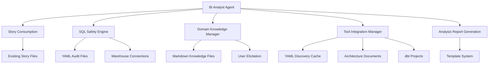

# Component Architecture

Based on my analysis of the PRD requirements and the hybrid data architecture established, the BI expansion pack introduces specialized components that integrate with existing BMAD-METHOD patterns while providing comprehensive BI analysis capabilities.

**New Components Required:**

## BI Analyst Agent Core
**Responsibility:** Primary agent orchestration and command processing following BMAD agent patterns
**Integration Points:** Existing template system, story consumption, CLI interaction patterns

**Key Interfaces:**
- `*execute-safe-sql`: SQL execution with safety classification and audit logging
- `*document-bi-integration`: BI tool discovery and configuration documentation
- `*accumulate-domain-knowledge`: Interactive domain knowledge building and validation
- `*generate-analysis`: SQL generation using domain knowledge and tool configurations

**Dependencies:**
- **Existing Components:** Template processing system, story file readers, CLI framework
- **New Components:** SQL Safety Engine, Domain Knowledge Manager, Tool Integration Manager

**Technology Stack:** Natural language processing, YAML configuration, file-based operations

## SQL Safety Engine
**Responsibility:** SQL operation classification and execution safety enforcement
**Integration Points:** File-based audit logging, user approval workflows, warehouse connections

**Key Interfaces:**
- `classifySQL(statement)`: Returns safety classification (SAFE, MUTATION, CONTEXT, BLOCKED)
- `executeWithSafety(sql, warehouse)`: Executes SQL with safety checks and audit logging
- `validateWarehouse(config)`: Tests warehouse connections and permissions

**Dependencies:**
- **Existing Components:** None (isolated safety system)
- **New Components:** Audit logging to YAML files, domain knowledge context for SQL generation

**Technology Stack:** sql-parser-cst for parsing, bash/curl for warehouse connections

## Domain Knowledge Manager
**Responsibility:** Business domain mapping persistence and analytical pattern learning
**Integration Points:** YAML/Markdown knowledge files, story context extraction, user elicitation workflows

**Key Interfaces:**
- `learnFromAnalysis(sql, business_context)`: Extracts and stores domain mappings from successful analyses
- `queryDomainMappings(business_term)`: Returns table/column mappings for business concepts
- `validateKnowledge(term, mapping)`: User validation workflow for domain knowledge accuracy
- `detectKnowledgeConflicts()`: Identifies contradictory mappings requiring resolution

**Dependencies:**
- **Existing Components:** Story file structure for context extraction
- **New Components:** YAML knowledge files, elicitation workflow templates

**Technology Stack:** YAML/Markdown file operations, automated sharding based on file size

## Tool Integration Manager
**Responsibility:** BI tool discovery, configuration extraction, and integration documentation
**Integration Points:** Architecture document reading, dbt project analysis, BI tool API connectivity

**Key Interfaces:**
- `discoverBIStack(architecture_doc)`: Parses architecture documents for BI tool references
- `analyzeDbtProject(project_path)`: Compiles dbt models and extracts schema metadata
- `validateToolConnections(tool_configs)`: Tests connectivity and API access for discovered tools
- `generateIntegrationReport()`: Creates comprehensive BI stack documentation

**Dependencies:**
- **Existing Components:** Architecture document readers (read-only access)
- **New Components:** YAML discovery cache, configuration file management

**Technology Stack:** dbt CLI subprocess integration, BI tool API clients via bash/curl, YAML caching

**Component Interaction Flow:**

**Integration with Existing Architecture:**

The BI components follow established BMAD-METHOD patterns:
- **Agent Pattern**: BI Analyst Agent uses identical command structure and persona definition as existing agents
- **Task Integration**: All component operations triggered through expansion pack tasks, not direct API calls  
- **Template Processing**: Analysis outputs use existing YAML template system with BI-specific extensions
- **Story Workflow**: Components consume existing PM→Architect story outputs without modification

**Component Boundaries and Isolation:**

- **Clear Separation**: Each component operates independently with defined interfaces
- **Error Isolation**: Component failures don't affect other components or core BMAD functionality
- **Data Isolation**: All component data stored within `.bmad-bi/` directory structure
- **Dependency Isolation**: No shared state between components except through YAML/Markdown files
